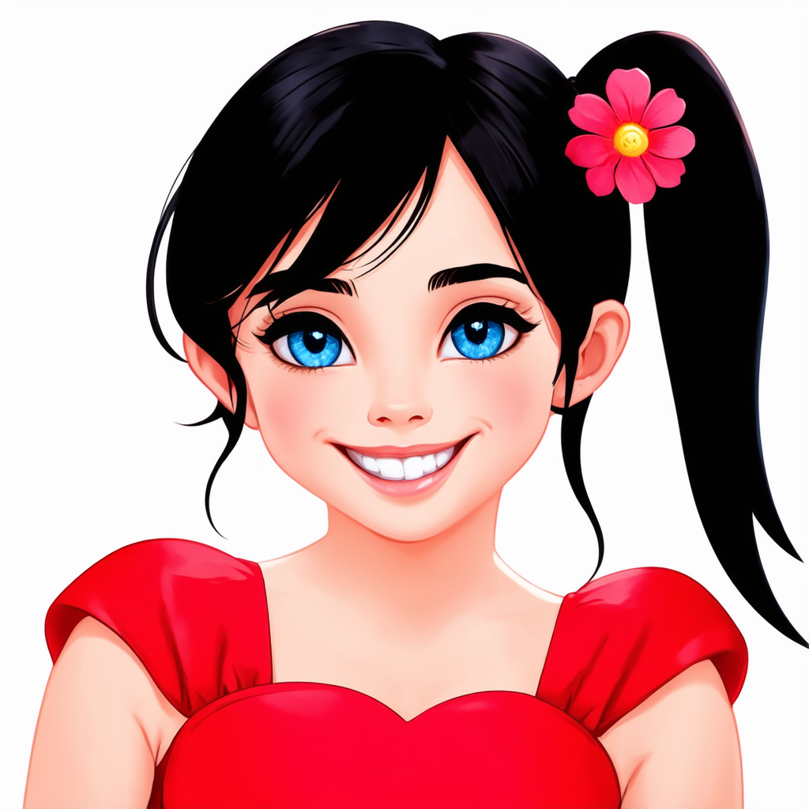
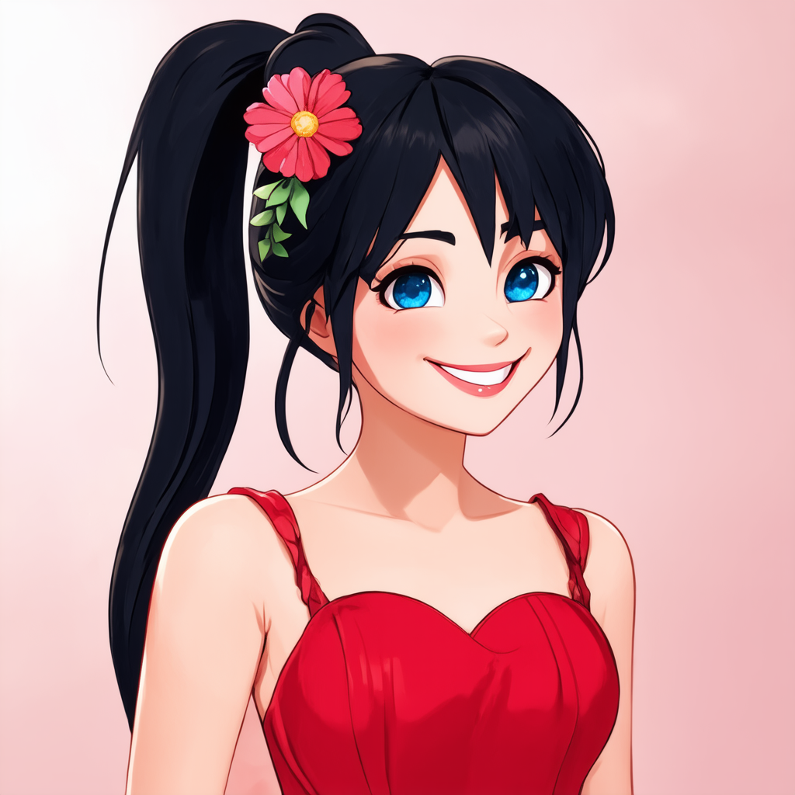

# GenshAIfyer
Hi! This is a personal project in progress. The objective is merely for fun and all
rights of the datasets are from ©MiHoYo, the Genshin Impact&#39;s game
developers (link to their website: [mihoyo](https://www.mihoyo.com/en/)).
Therefore, this project is **non-commercial use only**.

My personal objectives are to create Genshin Impact generative models:
- For personal fanart creation
- To give fans the opportunity to convert themselves or to create what&#39;s in their
imagination to Genshin Impact style.

## Stable Genshin
To start with this project, I have created a small dataset (dataset1) using screen
captures from playable characters in the game and prompts using ChatGPT
v4o, describing the main characteristics of these characters.

The first model is [Stable Difussion 3 Medium](https://huggingface.co/stabilityai/stable-diffusion-3-medium-diffusers)  with LoRA fine-tunning.

First results show how the model starts changing towards anime-style, still not
close enough to Genshin though, probably due to model bias.

Example showing the model evolving from this (same prompt, same seed):

To this, after finetunning:

**Hypothesis**: I probably need to pretrain the whole model using a large Genshin
Impact dataset in order to reach the desired results. But I will try other methods
with smaller datasets and lower computation capabilities:
1. LoRA with higher rank.
2. Make it learn a &quot;genshin style prompt&quot;. Training the embeder.
3. Prepare a larger and more diverse dataset with better prompts.
4. Among others.
